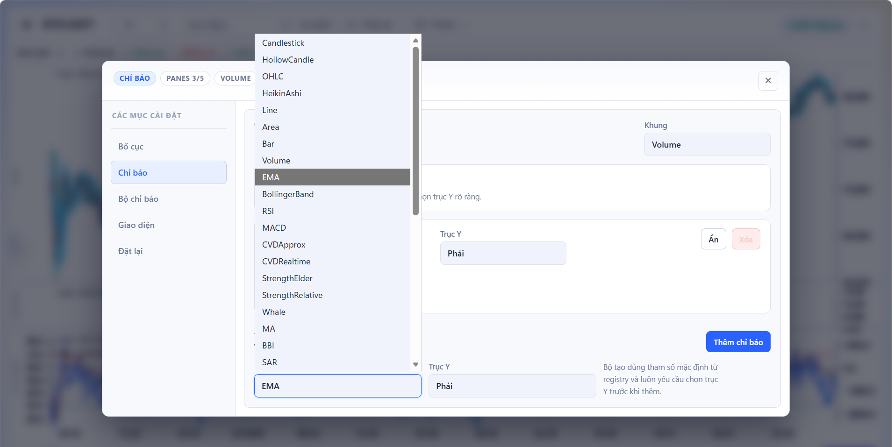

# VNBrokerChart

[](https://github.com/vietdungiitb/vnbrokercharts/releases/latest)
[](LICENSE)
[](https://react.dev)
[](https://www.typescriptlang.org)
[](https://stockchart.edusuccess.vn/)

> **🔗 Live Demo: [stockchart.edusuccess.vn](https://stockchart.edusuccess.vn/)**

Thư viện biểu đồ kỹ thuật cho thị trường chứng khoán Việt Nam. Xây dựng trên React 19 + D3 v7 với kiến trúc hybrid SVG/Canvas, SSOT canonical indicator store, và drawing tool layer có FSM interaction.

---

## Screenshots




---

## Quick start

```bash
npm install
npm run watch          # webpack dev server → http://localhost:3000
```

```bash
npm run build:docs     # build demo → build/
npm run build          # build library → dist/ (ESM + CJS)
npm run type-check     # TypeScript strict
npm test               # Vitest
python scripts/generate_module_tree.py
```

---

## Stack

| Layer | Công nghệ |
|---|---|
| UI | React 19 (hooks, `useReducer`) |
| Language | TypeScript strict |
| Rendering | D3 v7 — SVG cho axes, Canvas cho series |
| Build (demo) | Webpack 5 |
| Build (lib) | tsup — ESM + CJS dual output |
| Test | Vitest + jsdom |
| Styling | CSS Variables (`--gc-*`), `html[data-chart-theme]` root switching |
| Replay | `BarReplayController` — domain class, testable độc lập với React |

### Tại sao không dùng ECharts / Recharts?

D3 trực tiếp cho phép:

- Inject whale bubble annotations chính xác theo bar index trên canvas layer
- Drawing tools tương tác với chart coordinate system (xScale / yScale)
- Bar replay cắt visible data slice không trigger `ChartCanvas` full reset
- Volume Profile render cùng y-axis với price

---

## Kiến trúc

```
src/
├── lib/
│   ├── core/
│   │   ├── calculators/enrichData.ts          ← SSOT: tính toàn bộ indicator một lần
│   │   ├── calculators/seriesValueResolver.ts  ← canonical key → value lookup
│   │   ├── hooks/useDynamicPanes.ts            ← pane layout + series visibility
│   │   ├── replay/BarReplayController.ts       ← replay engine (no React dep)
│   │   ├── registry/SeriesRegistry.ts          ← series renderer registry
│   │   └── DynamicChart.tsx                    ← chart slot builder
│   ├── drawing/                                ← 20+ tools, FSM interaction, snap/magnet
│   └── types/
├── demo/
│   ├── LibraryShowcaseDemo.tsx                 ← demo shell
│   ├── demo.css                                ← gc-* layout variables
│   └── i18n.tsx                                ← VI/EN
└── widget/
    └── VNBrokerChart.tsx                       ← embeddable widget
```

**Invariants:**

- `src/lib/**` không được import từ `src/demo/**`
- Canonical key là identity — cùng key = cùng data, bất kể consumer
- Data flows down only — tầng trên chỉ đọc, không tính lại
- Presentation (màu, visibility) không tạo series key mới

---

## Tính năng hiện tại (v1.0.0)

| | Tính năng |
|---|---|
| ✅ | Live data Binance WebSocket (BTCUSDT demo) |
| ✅ | Dynamic panes + splitter resize (tối đa 5 pane) |
| ✅ | 20+ drawing tools: Trend Line, Fibonacci, Channel, ABCD, Pitchfork... |
| ✅ | Drawing: snap/magnet, undo/redo (patch commands), alert triggers |
| ✅ | Bar Replay + paper trading |
| ✅ | Indicator catalog: 30+ loại (EMA, BB, RSI, MACD, CVD, Whale, SAR, KDJ...) |
| ✅ | SSOT `enrichData` + `seriesValueResolver` |
| ✅ | Settings modal — layout, series params, trục Y per-indicator |
| ✅ | Dark / light theme (CSS Variables, không re-render) |
| ✅ | VI/EN i18n |
| 🔄 | VNInvest integration — Whale flow, CVD real-time |
| 📋 | Saved indicator sets / templates |
| 📋 | Visual DAG indicator builder |

---

## Community vs Pro+

Bản này là **Community (open-source, MPL-2.0)**. Phiên bản **Pro+** dành cho tổ chức / tích hợp sản xuất cung cấp thêm:

| Tính năng | Community | Pro+ |
|---|:---:|:---:|
| Toàn bộ tính năng Community | ✅ | ✅ |
| **History chunk store** — incremental persistence, gap fill, trim window | ❌ | ✅ |
| **Whale / CVD / Dark Flow overlays** — WhaleMarketBubble, CVDIndicator, ExternalCVD, DarkFlowBadge, whaleDetector | cơ bản | đầy đủ |
| **Drawing workspace nâng cao** — ~2x tools (Community) vs ~8x tools (Pro+): multi-select batch, floating selection toolbar, harmonic ratio validation, Gann Fan math, touch stylus | ❌ | ✅ |
| **Modular engine packages** — `vn-kline-engine-core` + `vn-kline-engine-react`; dual runtime: D3 SVG/Canvas legacy ⊕ KLineChart Canvas fork | ❌ | ✅ |
| **Custom render context API** — `WidgetPaneToolbarRenderContext`, `WidgetDrawingChromeRenderContext` | ❌ | ✅ |
| Hỗ trợ thương mại & SLA | ❌ | ✅ |

> Liên hệ nâng cấp: [vietdung@edusuccess.vn](mailto:vietdung@edusuccess.vn)

---

## Tài liệu

| File | Nội dung |
|---|---|
| [AGENTS.md](AGENTS.md) | Entry point cho AI agents, canonical commands |
| [quality/QUALITY.md](quality/QUALITY.md) | Quality gates |
| [public-docs/README.md](public-docs/README.md) | Tài liệu công khai |

---

## Đóng góp

Đọc [CONTRIBUTING.md](CONTRIBUTING.md) và [AGENTS.md](AGENTS.md) trước khi tạo PR.  
Mọi thay đổi lớn cần implementation plan được phê duyệt trước khi code.

---

MPL-2.0 © 2026 [Phạm Việt Dũng](mailto:vietdung@edusuccess.vn)
